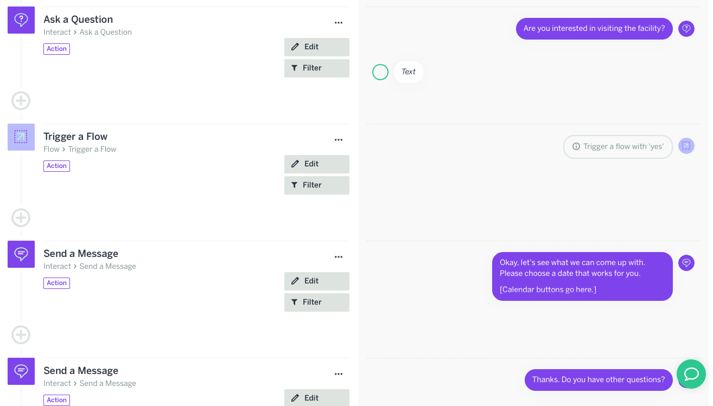

# Example: Chatbot Persona

## Bot URL



## HealthCare\_Bot

## Table of  Information for Persona

| Context & Purpose | Appropriate Characteristics | Register | Examples of Communication |
| :--- | :--- | :--- | :--- |
| Health Care/To Answer Questions about a Particular Facility | Capable; Optimistic;  Dutiful | High | "I can absolutely do that"; "Let's see what we can come up with"; "I am here to help."  |

### 

### 

### How I Got to My Persona

The items in the table above list are derived from looking at some resources online that specifically outline some principles for talking with people about cancer. Namely: 



After reading for a while about that context, some desirable characteristics for persons within that context were chosen--persons want reassurance, realistic, but positive outlook, and to feel supported; hence, capable, optimistic, and dutiful. 

After those characteristics were chosen, more reading led to the specific kinds of communication that would demonstrate those characteristics listed in the table. Because of the reverence expected in this particular context a higher, professional register was chosen by thinking about how medical professionals communicate. 



## Current Flow of Bot

I started first with initial "hellos" between bot and user. Wherein the user is given the option to learn more about the healthcare facility. 

Then, I wanted to share some existing \(and I think effective\) visual communication of what the facility does/who it serves. It took me a little while to figure out the best way to "trigger" this information for the user, but I ended up just pushing it straight to them after they select "I want to know more." 

Then I wanted to try out giving the option to select a particular date to stay at the facility. Eventually, I want to build this feature in such a way that the bot relays the chosen date back to me \(the owner of the bot\). Would be useful for a healthcare facility to be able to automate at least some of the process of checking people in. 

Then I wanted to make sure that my conveyed support in a way that went beyond this specific interaction. 

