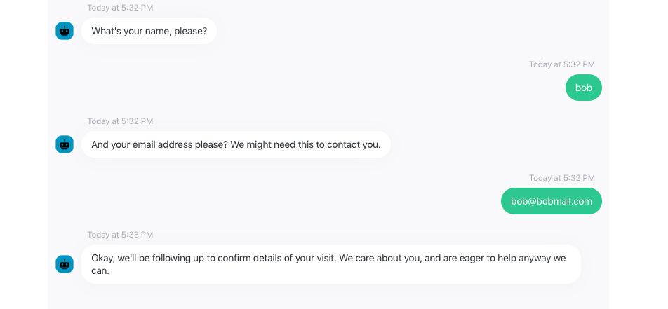

# Example: Chatbot Prototype

## Bot URL



## Bot Name

HealthCare\_Bot

## Tables of Persona Information 

#### Context & Purpose

| Appropriate Characteristics | Register | Examples of Communication |  |
| :--- | :--- | :--- | :--- |
| Health Care/To Answer Questions about a Particular Facility | Capable; Optimistic;  Dutiful | High | "I can absolutely help you with that"; "Let's see what we can come up with"; "I am here to help."  |

#### Type of Goal

| Goal\(s\) | Examples of Phrasing |  |
| :--- | :--- | :--- |
| Instrumental | Learning more about the facility; Scheduling visits to the facility.  | "I can absolutely help you with that"; "Let's see what we can come up with." |
| Relational  | Making sure that people know that they are valued as people \(not just patients, or paychecks\).  | "We care about you, and are eager to help you anyway we can."  |

### 

### How I Got to My Conversation Flow

As I pointed out in my [Chatbot Persona](example-chatbot-persona.md) assignment, I used some resources to help think about appropriate communication for  Namely:



After reading for a while about that context, some desirable characteristics for persons within that context were chosen--persons want reassurance, realistic, but positive outlook, and to feel supported; hence, capable, optimistic, and dutiful.

After those characteristics were chosen, more reading led to the specific kinds of communication that would demonstrate those characteristics listed in the table. Because of the reverence expected in this particular context a higher, professional register was chosen by thinking about how medical professionals communicate.



Because I am designing this bot to help facilitate information sharing and scheduling for the facility, I want it to focus more on the instrumental goals. 

However, I did notice that the original "I am here to help phrasing" might actually be misconstrued more as instrumental communication \(e.g., "I am here to help you find info"\) rather than relational \(e.g., "I am here for you emotionally"\). While I don't want to get into the weird space of having my bot act as if it is a true social entity \(that has capacity for empathy\), I do want to re-word to sound more relational in the sense that the organization is "speaking through" the bot. As such, I'll update as: 

> "We care about you, and are eager to help you anyway that we can."

You can imagine how these phrasings would be different for promoting a video game or some other instrumental goal that deserves less reverence. 

## Current Flow of Bot

I started first with initial "hellos" between bot and user. Wherein the user is given the option to learn more about the healthcare facility or to schedule a visit. 

### 

### Scheduling a Visit 

To create a flow for scheduling a visit I seleted the "appointment booking" template, and then rewrote it to be more in line with my table of planned phrases. The flow is initiated when the user selects "schedule a visit." 

Lucky enough the template already had a "listener" built in for picking up on the time and date requested. 

Then I wanted name and an email. Within the booking feature, I had it send the info to my email. 

I could foresee this being useful for creating initial contact \(but certainly not for replacing human to human interaction about healthcare\), so I wanted to be able to create a "hand off" mechanism for the visit scheduling. 

### Learning More

If the user selected "learn more" it initiated a "Frequently Asked Questinos" flow that shares exisitng information to the user. 

I think if this becomes my major project for the quarter, I will probably spend some more time building in individual flows for each kind of information, making the information acessible with phrases like "tell me about the facility" or "who are the people you serve?"

