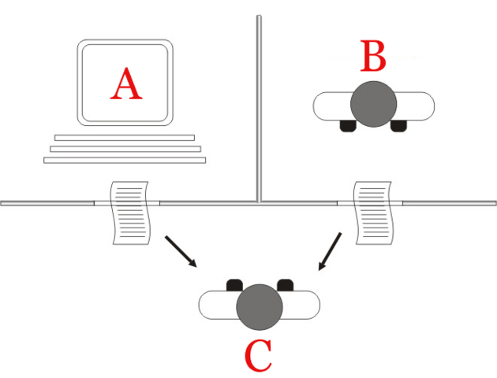
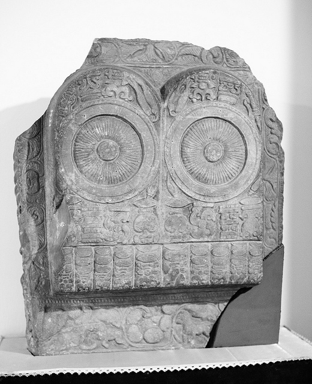
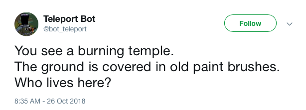
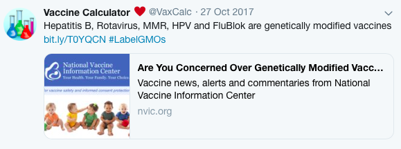
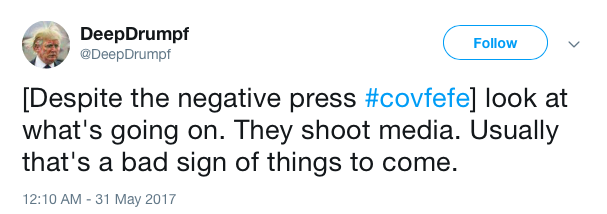

# Week 3: Social Machines

## Social Machines

Usually when we're talking about the _social_, we are talking about the coordination and communication between people and/or animals and/or insects and/or plants. My dog wags her tail to let me know she's happy. Blossums open to indicate that their nectar is avialable for bumble bees to consume. People smile at one another and share compliments to indicate that they appreciate one another. 

The social is a category that we reserve for animate, living matter--even redwood trees 'talk' with other life, in their own way. Inanimate matter--like a rock--on the other hand, even if a human were to talk to one, wouldn't necesarily be a social being, it is just a _thing_ that a person is treating socially. As such, prevailing wisdom tells us that non-living matter can be regarded socially, but, it most emphatically is _not social_. 

But what about bots? They are made up of silicon processors firing off software. There is no way we might think of them as social beings, right? 

Once our bots start operating on social media platforms, which, for all intents and purposes, were foundationally designed for social beings, things get a little complicated. 

In this module, we'll discuss social media bots. But we'll be defining two different kinds of social media bots, both of which operate on social media platforms, but in very different ways: _social bots_ and _machinic bots_. 

### 

## Social Bots

Some bots are effective because they are able to trick us into thinking that they are social beings, wielding the gravitas of a fellow person. Using the famous "Turing Test," we will define such bots below as _social bots_.  

### The \(Social\) Turing Test 

In 1950, Alan Turing--a famous character in the history of computing and the philosophy of conciousness--came up with a test for assessing whether or not a machine had successfully reached the level of intelligence of a person.

Unsurprisingly, the Turing Test \(as it later came to be called\) relied on communication. To perform the test required that a real human being \(we'll call them Being C\) sits behind a wall with only a computer terminal connecting them to two other individuals: Being A and Being B. One of those beings is a fellow person, and the other is a computer. 

If, after conversing with Being A and Being B, the person \(Being C\) cannot destinguish between the computer and their fellow person, one could say that the computer is sufficiently demonstrating intelligence. \(As to whether or not it _actually_ possesses intelligence is another matter, and one that Turing wisely instructs us to avoid getting wrapped up in.\) 

While we are not necessarily interested in "spoofing" intelligence in this course, we _are_ interested in another outcome achieved by passing the Turing test: the computer's achievement of the status of a _social_ _being_. 

If the person cannot distinguish between the two entities behind the wall, the options they are left with are to either 1\) treat both entities as inanimate _things_, or 2\) to treat both entities as _social_ beings. Since option 1 runs the risk of treating a real person like a machine \(disrespecting that person, in other words\) we are more likely to choose option 2. 

### The Problem of Social Machines

The problem with a machine that can pass the Turing test and successfully mimic another person is that, for better or worse, we humans appreciate when more than one person believes something. We give gravity to what our fellow social beings conclude to be true about the world. 



If four people can encourage a person to question themselves \(even when they have a perfectly good conclusion to begin with\) then we should be alarmed to learn that on social media platforms like Twitter and Facebook it is relatively easy for a single person to command 100s or even 1000s of machines that can masquerade as social beings. 


**Social bots** are bots that exact communicative effects that rely on the ability to appear as social beings. That is, social bots, are bots that employ the strategy of mimicking people in order to influence real humans. 

_Note: While not all social bot strategies rely on constructing large numbers of "followers," most social bots are employed via social media platforms._ 


Still not convinced that social bots are a reality? Go to this website and try to guess whether the excerpts are poetry made by a machine or a person. 



Were you able to guess the bot communication from the human communication? Probably not 100%. 

In the case of computer generated poetry, social bots seem harmless. Conversely, social bots can be used for all sorts of malicious things. 

**Advertising Fraud**



#### Election Tampering



#### Amplifying Hate Speech



With these kinds of examples it's easy to see that social bots are a problem. However, there are examples that at least force us to think about that easy conclusion, in that perhaps some amount of principled deception might be a good thing. 

#### Countering Racist Language



Because they rely on deception, here in this class we won't be making social bots. But it is important to think deeply about the potentially dystopic consequences of such technologies, right alongside the more utopian ones.  

There are also social media machines that are more "up front" about being bots. 

## Machinic Bots

In contrast to social bots, there are also bots that are effective precisely because they are _machines._ We will define these as _machinic bots_. 

### The Machinic "Aura"

"The Kingdom of Rome" is a story derived from the _Lokapannatti_, a Pali text written in the MIddle Ages.  In the story, Ajataśatru, an ancient Indian king learns of the well-gaurded Roman secret of making "spirit movement engines." With the help of an engineer versed in the art of making such machines, he builds a set of robot gaurds to protect a shrine full of Buddhist relics. 

Eventually, the robot gaurds are dismantled and King Aśoka \(Ajataśatru's grandson\) is able to collect the relics of the Buddha and redistribute them for all to appreciate. 

"The Kingdom of Rome" is speculated to have been written between the 11th or 12th century AD, making the text at least 800 years old. And the contents of the story are about a happening that occurred even earlier than that \(circa 300 BCE\)! It is one of the oldest known accounts of robots. 

The story is whimsical, fantastic and beautifully asks the reader to reflect on things like the spirit \(as in that which drives the machines, and possibly people\) and even power differentials spoken through the artifacts and techniques of our technologies \(as in the unwillingness of Rome to share their science\). 

Imagine interacting with one of those robots. Imagine further that you witnessed one writing the poetry that would be used in the "Bot or Not?" website cited earlier? Would this not make that writing somehow magical? Or would you attribute nonhuman qualities to the robot, like objectivity?  

In any case, you would treat the messages created by that bot \(as social as they may seem\) as those with their very own "aura," or special energy--a machinic aura. 


**Machinic bots** are bots that exact communicative effects precisely because they appear to communicate as _machines_. That is, machinic bots employ the strategy of enhancing messages with machinic aura \(the energy of a machine\) in order to compell humans. 

_Note: While not relying on the status of a social entity per se, a machinic bot is technically also a social machine in that it is designed to coordinate meaning with humans._ 


#### 

### Machines as Communicators 

Combining our earlier [discussion](../content-types-and-uses-of-self-moving-computational-media/) of automated communication as exposition, persuasion, and artistic experience with the current discussion of machinic bot strategies it is useful to imagine the bot as their own entities as they make their own messages. Machinic bots have implications to our main categories of automated communication. 

#### Machines as Artists \(Artistic Experience\) 

Sometimes messages created by bots are effective because they come directly from machines giving it a sort of magical "aura." Fun, novelty, excitement characterize these kinds of messages. Teleport Bot, for example, tells small stories that ask the viewer to think deeply. Does the fact that this comes from a bot enhance your artisitic experience with it? 

#### 

#### Machines as Scientists \(Exposition\) 

Beyond fun art though, the machinic aura can also be appropriated by automating messages in ways that "copy" established traditions of credibility in order to add legitimacy to illegitimate claims. Vaccine Calculator, for instance, mimics the language of credible scientific consensus and links back to psuedoscientific websites. In a way, the automated character of aura of the bot, helps augment the attempt at "objectivity" and "facticity" of its messaging. 

#### Machines as Politicians \(Persuasion\) 

Perhaps in a way that combines elements of art and exposition, we can also make arguments about things like politicians. A parody of Donald Trump, built from a machine learning system "trained" to speak like Donald Trump--DeepDrumpf--for example, helps audience members treat the content as "facts" to be witnessed rather than a performance to agree with \(as would be in the case of a human performing the parody of Trump\). 

The overall learning moment here is that, yes, social bot strategies work by tricking people, and therefore, are largely untenable as an ethical means of communication. 

However, just because machinic bot strategies are not tricking people into thinking they are human doesn't mean they are beyond ethical consideration. 

Machines can argue, and sometimes, we listen to them _specifically because they are machines_. 

### \*\*\*\*

## **This Week's Reading and Assignments**

#### **Reading**

**Chapters 5 and 6 of** [_**Designing Bots**_](file:///autocomm/~/edit/drafts/-LO_Kxqem2Og_1VNlU53/syllabus/syllabus-1/course-text)**.** Think about a social machinic bot concept that you want to make. What would its personality be? What would the purpose of that bot be? Would it solve a problem? Raise awareness? Would it be art? What platform will you use? 

\*\*\*\*

#### **Assignments**

When you are done with the readings for the week, building on your work [analyzing a bot platform](../content-getting-communication-work-done-ethically-and-legally/platform-analysis.md), and looking on to our upcoming [social media bot](../week-4/twitterbot.md) assignment, **come up with a** [**social media bot concept/image**](twitterbot-concept-image.md). 

#### Further Readings





