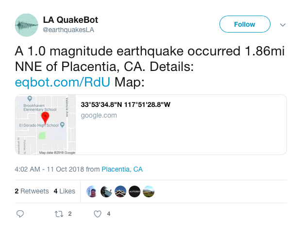
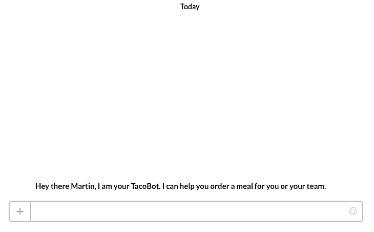
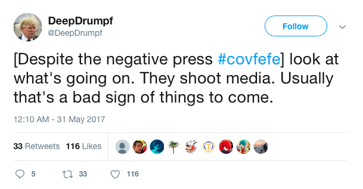
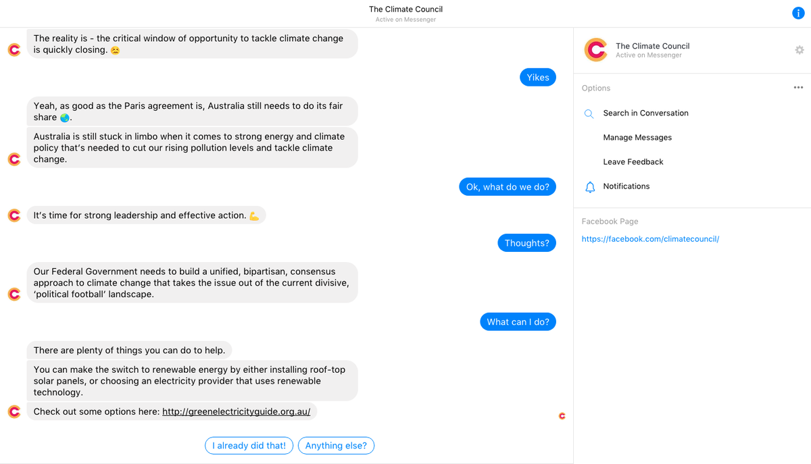
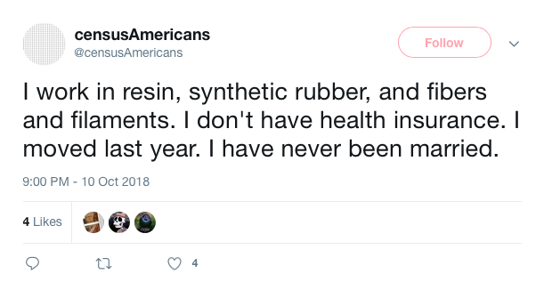
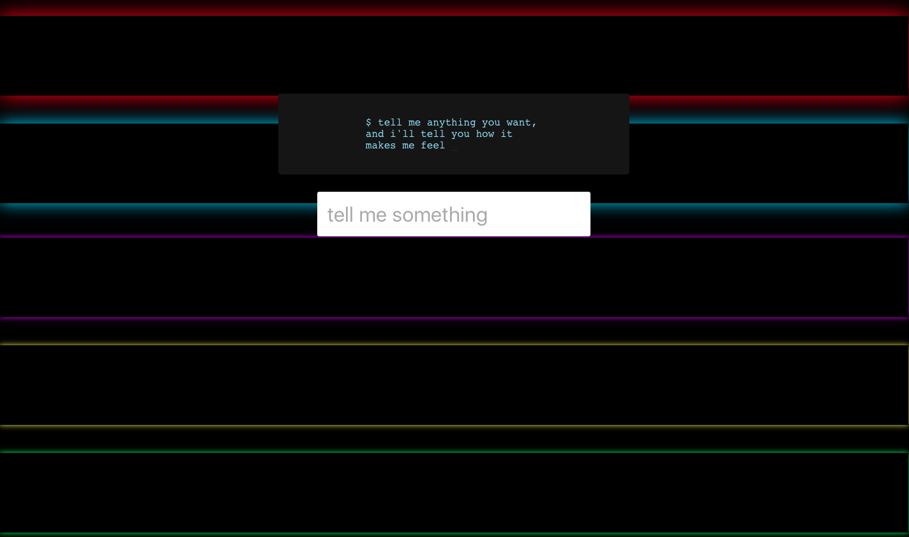

# Week 1: Computational Media & Automated Communication

## Computational Media and Automated Communication

Communication is a defining characteristic of the human condition. As history marches on and society evolves, so too do our tools of messaging. In the Western tradition we have been studying media, and how to use those media effectively, for at least the last 2300 years. 

1. The ancient Greeks and Romans studied effective speaking in the courts. 
2. Rennaissance and Enlightenment era thinkers thought about how to write "[perspicacious](https://www.merriam-webster.com/dictionary/perspicacious)" letters and books. 
3. Scholars of the 20th century studied how to get effective radio "sound bites" and flattering lighting for television broadcasts. 

Today, we live among the internet, video games, chatbots, and mobile applications. These are computational media! 

### Computational Media 

Before we give a specific definition of computational media let's first define both _media_ and _computation_ indvidually. 


**Media** \(plural of medium\) are the vehicles that deliver human expressions. Paper, .mp3s, print books, oil canvases--each is a medium that carries messages to our eyes, ears, and finger tips. 



**Computation** can mean to carry out a computation, or to _do math_. However, the way that we are using computation is in the other sense of the word: engaging the act of using a computer, or a machine designed to carry out mathematical/logical processes. 


When we combine computation and media we get a specific kind of computing--one that is concerned with the effective delivery of human expression. We also get a specific kind of media--those which rely on the use of computing machines to exist. Let's button that up in a nice crisp definition, centered on the area of study and practice that this course falls within. 


**Computational Media** is an interdisciplinary area of study and production that focuses on media that find form via computers. 


Computational media as a field tends to be largely occupied with the video game as an object of study and production. For example, take a look at the groundbreaking work of the [Computational Media](https://www.soe.ucsc.edu/departments/computational-media) program at University of California, Santa Cruz.

This course, by contrast, is interested in a different object of focus. 

### Automated Communication 

Increasingly there are opportunities to "hand off" messaging to machines. When we do, there is potential to offset the costs of expensive call centers with a chatbot that follows a "script" to give users a pleasantly brief and efficient means by which to ask, and get answers to, their questions.  There are also possibilites of positively affecting public discussion with the use of social bots that engage debates on Twitter about a temultuous political issue or to correct public misunderstandings of science. Of course, social machines can be just for fun too. All of these cases are  instances of automated communication. 


**Automated Communication** is a form of computational media whereien social machines \(entities designed to communicate intelligibly with humans\) are employed to engage the exposition of facts, the persuasion of beliefs, and/or the engagement of artistic experiences.  


As is aparent from the course description as well as the start of this current section, this class is interested in a specific kind of automated communication: bots. Let's look at some specific examples of automated communication in the form of bots that specialize in exposition, persuasion, and artistic experience. 

#### Exposition











#### 

#### Persuasion











#### 

#### Artistic Experience 











#### 

#### Experience the Bots Firsthand

| Exposition | Persuasion | Artistic Experience |
| :--- | :--- | :--- |
| [LAQuakeBot](https://twitter.com/earthquakesLA?ref_src=twsrc%5Egoogle%7Ctwcamp%5Eserp%7Ctwgr%5Eauthor) | [DeepDrumpf](https://twitter.com/deepdrumpf?lang=en) | [censusAmericans](https://twitter.com/censusAmericans?ref_src=twsrc%5Egoogle%7Ctwcamp%5Eserp%7Ctwgr%5Eauthor) |
| [TacoBot](https://www.tacobell.com/Tacobot) | [Climate ChatBot](https://www.akqa.com/work/climate-council/climate-council-chatbot/) | [feels\_bot](http://milesccoleman.com/feels_bot/#/) |

### 

## The Kinds of Bots We'll be Making

[Bots](https://en.wikipedia.org/wiki/Internet_bot) have been around for a lot longer than you'd think. And, they do all sorts of things. [They](http://benlandes.com/index.php?page=uwcoursebot) might "listen" for the available classes for a given term in order to "get there" first and to complete the registration for a student who has a finite registration window. There are even [bots](https://woebot.io) designed to help give people an avendue for "talking it out" when they are in psychological distress. 

Bots exist on a spectrum of "sociality," meaning that some bots are designed, and scripted to interact directly with people, while some others are designed to work in the "background" without bothering people. We'll be making bots that fall heavier on the social side of the spectrum. 

We'll be focusing on making three differnet kinds of bots. 


**Social bots** are instances of automated communication that use social media to share messaging. Sometimes they are used to "[tweet](https://news.vice.com/en_us/article/ne4w3k/alt-right-racists-twitter-bot)" relentlessly at a given hashtag on Twitter. Other times, they might bring levity to discussion forums on Reddit by making random jokes. 

_The defining characteristic of a social bot is that it is an automated system, operating a social media account._ 



**Chatbots** automated communication experiences, which can exist in a standalone fashion \(meaning separate from a social media platform\), but which are designed to mimic conversational exchange. The might exist to [answer](https://www.admithub.com) techical questions about navigating the university system or to help inform people about the purpose of a nonprofit organization by allowing for more pointed questions to be asked, rather than having to skim through a "frequently asked questions" forum. 

_The defining characteristic of chatbots is that they are conversational, designed to engage in dialogue--a one-to-one interaction, rather than a one-to-many._ 



**Voice-based experiences** use speech, rather than text, as the "interface" for engaging a given automated experience. These instances of automated communication might give you a run down on your calendar for the day or help you define a difficult word. 

_The defining characteristic of a voice-based experience is that it requires that the user speaks to it; and the bot responds with its own._ 


Chatbots might exist on social media. And, a chatbot might use a voice-based interface. But, nonetheless, each of these interaction types requires different sensibilities and knowledge. So, we'll be taking those on in three different assignments \(explained in the following section\). 

### 

### What Kind of Bot-Maker are You? 

With all of this in mind, think about your own passions interests and talents. Are you someone who would be good at making useful "explainer" bots? Or would your talents be better suited to advocating for the public good? Does making art with bots align with your passions? Think about this and then take a look at our major assignments for the term. 

## Major Assignments for the Term

The course has been designed around four major assignments. Three of them are smaller bot projects. 

#### Individual Bot Projects 

1. [Social Bot](../week-4/twitterbot.md)
2. [Chatbot](../week-6/chatbot-prototype.md)
3. [Voice-Based Experience](../week-8/voice-based-prototype.md)

For the fourth major assignment, you will build on one of the three small bot projects \(or multiple if it makes sense\) to create a "deployable"--complete, operational, and public facing--social bot, chatbot, or voice-based experience. 

   4. [Final Project](../week-10/final-project-plan-for-continuous-improvement.md)

## This Week's Readings and Assignments

#### Readings

**Chapters 1 and 2 of** [_**Designing Bots**_](file:///autocomm/~/edit/drafts/-LO_Kxqem2Og_1VNlU53/syllabus/syllabus-1/course-text)**.** Take notes about the things that you find interesting and are excited about \(these will come in handy as you do your discussion post for the week. 

#### Assignments

After you do this week's reading share your thoughts on what kinds of projects we're interested to explore and make \(e.g., Would your automated communication deal with expository, persuasive, or artistic discourses?\). 

You'll find more details in the [**Machines as Communicators**](discussion-1.md) ****assignment description on the following page. 

