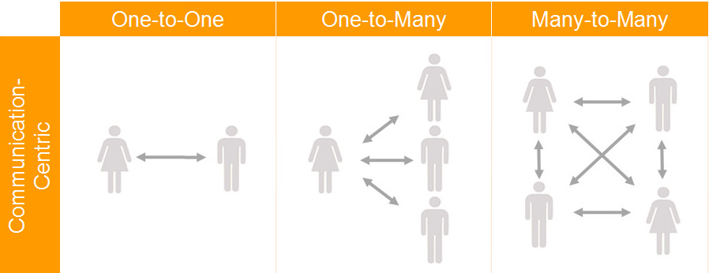

# Week 4: Message Scripting

## Making Compelling Scripts

Social [scripts](https://en.wikipedia.org/wiki/Script_theory) are an oft-used concept regarding human behavior and social interaction. Psychology, communication studies, performance studies \(e.g., theatre\), English, philosophy--many social scientific and humanities based disciplines talk about the scripts we follow in day to day life. In this week's module, we'll be examining some ways to _script_ the kinds of communication that our bots will follow when making messages. 

### Scripts: They're Not Just for Special Occasions

Often when we're talking about scripts, we are talking about special occasions, or even highly dramatized or "fake" interactions. Scripts are the things that movies and stage plays are based on, in other words. However, the way that we will talk about scripts has to do with everyday communication, and genuine communication, based on sequences of messaging that we have learned \(culturally\) to expect. 


**Social scripts** are the behaviors, actions, and outcomes that are expected from particular contexts. The social script that one follows when meeting a professional colleague for the first time is different from the social script of how to console a close friend or to make a joke with your significant other. 

_Note: Social scripts, because they are "second nature" are often invisible until our expectations are not met._ 


As an example, let's look at a common script, that we're all familar with: the introduction script. 

#### Everyday Interactions as Scripts

All cultures have some sort of introduction script. That is, a sequence of events that takes place when two people meet one another for the first time. This varies from culture to culture, but let's look at a common U.S. introduction script. We'll number the "steps" people follow when enacting the script. Then, we'll find those steps in an example exchange. 

1. Saluations \("Hello."\)
2. Sharing of names \("Hi, I am Botty McBotterson." "I'm Robot Bot III."\) 
3. Positive acknowledgement that this is the first meeting \("It's very nice to meet you."\) 
4. Both persons \(usually\) shake hands. 

Imagine how off-putting it would be to be introduced to someone for the first time, and they skipped step three, even though you hadn't. You present your hand for the handshake and they simply look your hand and smile. Would that give you good feelings or bad feelings? Violating expectations of social script, at least brings attention to the interaction, potentially overriding the important info \(like peoples' names\). Thus, scripts become incredibly important to us as bot makers as we want to build scripts into our bots, which, at the bare minimum, allow us to operate within the sequences of communication that are "natural" for us. We want our users' expectations to be met. \(Although, in some cases we want to strategically disrupt their expectations too.\) 

How do we get there? We'll, through thoughtful trial and error! 

We'll be making our own bots--which play off of common messaging patterns--in order to wager a political critique, make a compelling joke, or to effectively teach people something on social media. 

## Monologic and Dialogic Scripts

The options we'll be working with allow for the creation of either a Twitter bot, or a Facebook Messenger bot. Both of these tools are designed to make "one to many" messages, meaning they are more _monologic_ that they are _dialogic_. 

### **Monologic Scripts**

The root words of monologic are _monos_, which comes from the Greek for "alone," and _logos_, "word" \(or "speech"\). To engage a monologue, then, is to speak alone. Giving a speech to a large audience, for example, is a monologue--one person speaks, many others listen. In communication studies this is a one-to-many model of communication, relevant to television, radio, podcasts, Youtube videos, and many other media channels. 

Technically speaking, we live amid the many-to-many paradigm, wherein many people communicate to many others on the internet. But, for all intents and purposes, we'll be making one-to-many messages this week. Our one bot makes a message and many others listen. 

Making monologic bot strategies is a lot like being a speech writer, only your messages are often made in short bursts which build on one another to engage make political statements, share useful information, or to give people compelling artistic experiences. 

Just like any other realm of communication one-to-many communication has scripts that we \(the writers of such communications\) have to bear in mind, as our audiences will have expectations not only about _what_ we are saying, but _how_ we are saying it. 

Check out _American Rhetoric_ for examples of good speeches. These can be hugely generative for you to think about the kinds of scripts that we often expect in one-to-many communication. 



#### Twitter 



#### Facebook



