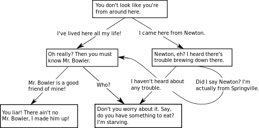

# Week 4: Message Scripting

## Making Compelling Scripts

Social [scripts](https://en.wikipedia.org/wiki/Script_theory) are an oft-used concept regarding human behavior and social interaction. Psychology, communication studies, performance studies \(e.g., theatre\), English, philosophy--many social scientific and humanities based disciplines talk about the scripts we follow in day to day life. In this week's module, we'll be examining some ways to _script_ the kinds of communication that our bots will follow when making messages. 

### The Scripts of Everday Interactions

Often when we're talking about scripts, we are talking about special occasions, or even highly dramatized or "fake" interactions. Scripts are the things that movies and stage plays are based on. However, the way that we will talk about scripts has to do with everyday, genuine communication, based on sequences of messaging that we have been taught \(culturally\) to expect. 


**Social scripts** are the behaviors, actions, and outcomes that are expected from particular contexts. The social script that one follows when meeting a professional colleague for the first time is different from the social script of how to console a close friend or to make a joke with your significant other. 

_Note: Social scripts, because they are "second nature" are often invisible until our expectations are not met._ 


As an example, let's look at a common script we're all familar with: the introduction script. 

#### 

#### The Introduction Script

All cultures have some sort of introduction script. That is, a sequence of events that takes place when two people meet one another for the first time. This varies from culture to culture, but let's look at a common U.S. introduction script. We'll number the "steps" people follow when enacting the script. Then, we'll find those steps in an example exchange. 

1. Saluations \("Hello"\)
2. Sharing of names \("Hi, I am Botty McBotterson" "I'm Robot Bot III"\) 
3. Positive acknowledgement that this is the first meeting \("It's very nice to meet you"\) 
4. Both persons \(usually\) shake hands 

Imagine how off-putting it would be if someone skipped step three, even though you hadn't. You present your hand for the handshake and they simply look your hand and smile. Would that give you good feelings or bad feelings? Violating expectations of social script, at bare minimum, brings attention to the interaction, potentially overriding the important info \(like peoples' names\). Thus, scripts become incredibly important to us as bot makers as we want to build scripts into our bots, which, allow users to operate within the sequences of communication that are "natural" for them. We want our users' expectations to be met. \(Although, in some cases, we want to strategically disrupt their expectations too.\) 

How do we get there? We'll, through thoughtful trial and error of course! 

We'll be making our own bots--which play off of common messaging patterns--in order to wager a political critique, make a compelling joke, or to effectively teach people something on social media. 

## Monologic and Dialogic Scripts

This week you'll have the choice of making a Twitter bot or a Facebook Messenger bot. As we do, we'll be thinking generally about bot design along the lines of "one to many" messages, meaning they are more _monologic_ that they are _dialogic_. Let's distinguish monologic communication from its counterpart, dialogic communication. 

### \*\*\*\*

### **Monologic Scripts**

The root words of monologic are _monos_, which comes from the Greek for "alone," and _logos_, "word" \(or "speech"\). To engage a monologue, then, is to speak alone. Giving a speech to a large audience, for example, is a monologue--one person speaks, many others listen. In communication studies, this is the one-to-many model of communication, relevant to television, radio, podcasts, Youtube videos, and many other media channels. 

Technically speaking, we live amid the many-to-many paradigm, wherein many people communicate to many others on the internet. But, for all intents and purposes, we'll be making one-to-many messages this week. Our one bot makes a message and many others listen. 

#### 

#### Monologue as a Type of Communication

Just like any other realm of communication one-to-many communication has scripts that we \(the writers of such communications\) have to bear in mind, as our audiences will have expectations not only about _what_ we are saying, but _how_ we are saying it. 

Check out _American Rhetoric_ for examples of good speeches. These can be hugely generative for you to think about the kinds of scripts that we often expect in one-to-many communication. 



\*\*\*\*

#### **Some Examples of Monologic Bots**

Making monologic bot strategies is a lot like being a speech writer, only your messages are often made in short bursts which build on one another to engage make political statements, share useful information, or to give people compelling artistic experiences. Check out some examples in this article. 



What was your favorite example? What kinds of social scripts is it following \(or breaking\)? What are your ideas for making a monologic [social media bot ](twitterbot.md)this week? 

### \*\*\*\*

### **Dialogic Scripts**

Though we can be moved by powerful, well-crafted monologic communication, another communication context involves not the transmission of a single message from one to many, but rather the _exchange_ of messages between one and another. 

Dialogic--like monologic--also has Greek roots in the prefix _dia_, "across," and _logos_, "word" \(or "speech"\)--"words across." The distinct difference between monologic and dialogic scripts is that monologic scripts are involved in contexts where _response_ is not expected, whereas dialogic scripts are based in explicitly in the expectations of the kinds of responses that one negotiates with another. 

Some bots are good public speakers, others are good conversationalists; both require effective consideration of social scripts in order to be successful. 

One of the main tools of planning successful dialogues is the _dialogue tree_ \(later in the term, we'll be making our own\). The pre-built responses of chatbots can be visualized into maps that illutrate the sequencing of a given dialogic exchange. 

#### Dialogue as a Type of Communication 

Dialogue--a fancy way to say conversation--is something that has been studied for a long time \(at least 2500 years in the Western tradition\). One common theme to be found from the numerous treatises, magazine articles, and self-help workshops that center on the art of dialogue, is _listening_. If one does not listen to what the other says, they are not actually engaging dialogue at all, it is simply just two people engaging in monologue with each other. 

The defining characteristic of dialogic bot strategies is that they _adapt_ to users' input, while following social scripts appropriate to conversational exchange. 

Check an example discussion of what makes good conversation here. 



#### 

#### Some Examples of Dialogic Bots

Making a dialogic bot requires thinking about the exchanges and responses between bot and user that will be fun, or enlightening, or persuasive. Check out some examples here. 





What was your favorite example? What kinds of social scripts is it following \(or breaking\)? Does this give you ideas for how you want to start thinking about the [chatbot](../week-6/chatbot-prototype.md) and/or [voice-based experience](../week-8/voice-based-prototype.md) you'll be making later in the term? 

## This Week's Readings and Assignments

#### Readings

**Chapters 8 and 9 of** [_**Designing Bots**_](file:///autocomm/~/edit/drafts/-LO_Kxqem2Og_1VNlU53/syllabus/syllabus-1/course-text)**.** Think about the kinds of scripting that take place in bot design. Also, think about what kinds of content you're excited to bring into your bots. Will you use emojis in your social media bot? .gif files later in the term when you make your chatbot? 

#### Assignments

Applying what you've learned from the readings, and conintuing the work you started in your [social media bot concept/image](../content-machines-as-advocates/twitterbot-concept-image.md) assignment, you will **make a** [**social media bot**](twitterbot.md). 

