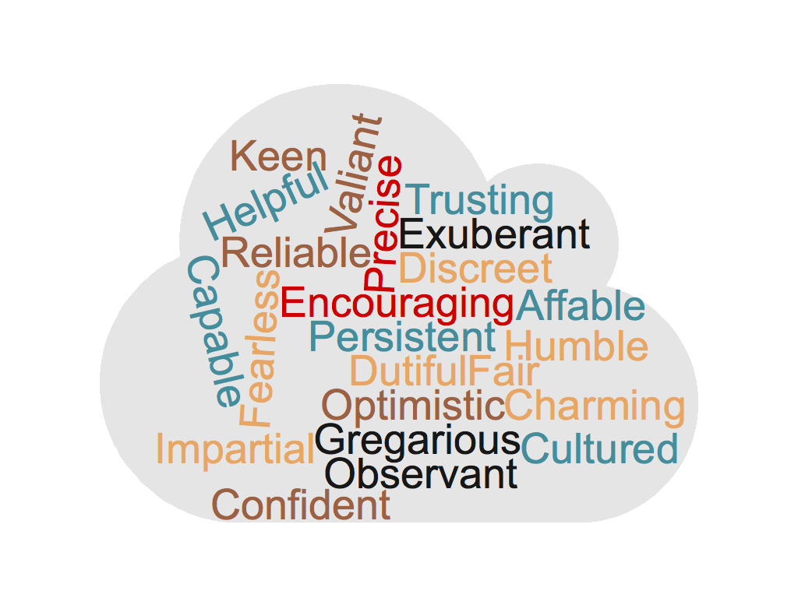

# Week 5: Chatbots

## Machines as Guides

Chatbots are used as resources to answer frequently asked questions, give banking information, help to offer healthcare feedback, and the list goes on. Increasingly they help save valuable time and resources by reducing the need for customers to ask the "call center," or to traverse pages and pages of technical documentation, or even to give "pitches" for ideas or products. 

Private, public, and nonprofit sectors can better support the people they serve by including topic-specific assistants, designed to guide them to the information they need and/or to support them in accomplishing particular tasks. 

In the previous module, we discussed the differences between monologic and dialogic scripts. Chatbots--as implied by the word "chat"--rely on dialogic scripts, and are designed to respond dynamically to the inquiries of users. On our way to designing conversational interfaces in the module directly following this one, we will start first with some consideration of an important aspect of our design of conversational interfaces: persona. 

But, first we need to make a quick stop at the often too-simplistic assumption that good chatbots are human-like. 

### It's Not as Simple as "They Remind Us of Humans" 

in 1966, Joeseph Wiezenbaum--a now famed and accomplished computer scientist--shared a sofware program with the world. ELIZA, the name of the program, and it was designed to engage people in ways that recreated a "back and forth" of conversation between a human and machine. Weizenbaum, ten years later, in his book _Computer Power and Human Reason_, describes a specific script he wrote--DOCTOR--which was a machinic parody of a Rogerian psychotherapist, meant to reveal how trivial, superficial, and artificial conversatons between people and machines actually are. Much to his surprise, he found not only that people positively engaged the bot, but that they even opened up to the bot much like they were interacting with a real therapist. 

Weizenbaum's explanation for this is that people were ascribing human characteristics to the bot, and therefore could confide in the software program as if they were engaging a real person. 

Weizenbaum's anthropomorphism conclusion is complicated, however, by work like Nass and Moon's study of "Machines and Mindlessness: Social Responses to Computers." _Mindlessness_ as Nass and Moon desribe it, helps to account for the ways in which people  apply social scripts to machines, even when they realize that they are _not social entities_. 

When people expect "please" and "thank you" from a machine, and return those sentiments when conversing with a machine, it is not based on concious acknolwedgement of the entity they are communicating with; it is because they are on "auto-pilot," communicating in ways that represent the routines and rituals of everyday communicaiton \(which is mostly with other humans\).

So, technically, yes, we want bots that demonstrate an understanding of human social scripts. But that does not mean that we like some bots simply because they remind us of humans. Perhaps a counterargument to Weizenbaum would be that people confided in ELIZA exactly because they knew it was a _machine_. And, as such, ELIZA would withold judgement \(a human\) allowing the person to speak freely. The human-script based nicety of saying, "I am sorry to hear that you are depressed," does not lead the person to know that they are conversing with a human--it just allows more mindless, free flowing communication with a machine. 

Further reason for looking to fill specific communication niches and needs with machines can be found in Georgia State's POUNCE chatbot, designed to incoming students register for classes, sign up for financial aid, and access campus resources. 



The important finding from the case study of the POUNCE chatbot was that first-generation, and Pell Grant recieving students \(students coming from lower socio-economic statuses\) had higher rates of engagement regarding questions about registration, financial aid, et cetera than years prior without the chatbot. What this means is that students who might have felt afraid to ask "dumb" questions, because they are unfamiliar with the terrain of higher education, seemed to feel freer to ask the chatbot. Was this because they thought POUNCE was human. \(Probably not.\) 

Certainly, we humans communicate best when we are operating within scripts that we are used to. But there are also opportunities to think about chatbot designs that expclicitly recognize that they are _not human_. 

In all chatbot designs there is a requirement to think about the persona that chatbot presents. 

## Bot Persona 

In marketing, the word _persona_ is often used to designate specific "kinds" of customers. This use of the word is bizarre, considering that, in every other context of using the term it designates the character presented by an actor \(both in the sense of drama, and in the sense of enacting social scripts in everyday life\). In fact, the original Latin use of the word meant the mask that an actor wore on stage, later informing how we think of persona as performed character. For our purposes we'll be using the idea of persona to designate the performed character of our bots.  


**Persona** the characteristics of temperment, charm, dynamicism \(and others\) perceptible from the communication of a given entity \(can be machinic or social\). Personas can be appropriate or innapropriate. Being "jokey" while retrieiving answers  to someone's questions about a serious health condition, or being too dry while answering questions about a goofy video game seem like innapropriate choices of design regarding persona. 


The reason we use the word _persona_ and not personality \(as is the case in our textbook\) is because we are thinking of the performance of particular characteristics, rather than the possesion of them. You can be a perfectly humble person. But if you don't communicate in a way that others can see that it is just an aspect of your personality, not yet represented in your persona. 

How will your bot communicate? What persona will it demonstrate in its communication? How will it demonstrate those characteristics? 

The way we will do this is is by being very deliberate in planning the persona for our bots. 

### Persona Planning

The method we will use for planning our bot personas will be to choose a context and purpose for our bot. Then, we will identify characteristics that would be appropriate for that context. Then we will identify the "register," or level of formality of the langauge choice \(levels of slang, professional tone\). And, finally, we will identify specific ways to communicate those characteristics in ways that do not detract from the original purpose of the bot. Included in these plans are also ideas of the kinds of nonverbal communication we might include in the form of emoji characters or even .gif files. 

Let's look at two differnet examples. 

#### Health Care \(Specifically about Cancer\) 

| Context & Purpose | Appropriate Characteristics | Register | Examples of Communication |
| :--- | :--- | :--- | :--- |
| Health Care/To Answer Questions about a Particular Facility | Capable; Optimistic;  Dutiful | High | "I can absolutely help you with that"; "Let's see what we can come up with"; "I am here to help."  |

The items in the table above list are derived from looking at some resources online that specifically outline some principles for talking with people about cancer. After reading for a while about that context, some desirable characteristics for persons within that context were chosen--persons want reassurance, realistic, but positive outlook, and to feel supported; hence, capable, optimistic, and dutiful. After those characteristics were chosen, more reading led to the specific kinds of communication that would demonstrate those characteristics listed in the table. 

#### Entertainment \(Promoting a Video Game\) 

| Context & Purpose | Appropriate Characteristics | Register | Examples of Communication |
| :--- | :--- | :--- | :--- |
| Entertainment/To Present a Pitch for a New Video Game | Charming; Confident;  Cultured | Low | "You've chosen a bomb way to spend your time! 😎"; "The game is soooooo fun **\[.gif file of "unicorn happily runing over a rainbow"\]**"; "This game makes other role playing games look boring. It's packed with so much stuff **\[.gif file of "exmple gameplay"\]**."  |

Similar to the healthcare table the contents for this persona plan were generated by reading examples of others promoting their video games in order to discover appealing characteristics and appropriate register. The communication examples that represent the characteristics were generated by looking at common places where people talk about video games \(like the social media platform, Reddit\). Those communication styles are emulated here in the examples of what the bot would say.  

It is because when someone is "annoying," or "stupid," or "offputting" that person is probabyl also transgressing expectations bound to a particular context, we want to be thoughtful about our bots up front. Where we can be forgiving of a person who says the wrong thing, it is exponentially difficult to forgive a machine. 

## This Week's Readings and Assignments

#### Readings

**Chapters 6 and 12 of** [_**Designing Bots**_](file:///autocomm/~/edit/drafts/-LO_Kxqem2Og_1VNlU53/syllabus/syllabus-1/course-text)**.** Think about the kinds of engagements and persona your bot will represent. 

#### Assignments

Ramping up to our [Chatbot Prototype](../week-6/chatbot-prototype.md), we will **make a** [**Chatbot Persona**](chatbot-persona.md). 

